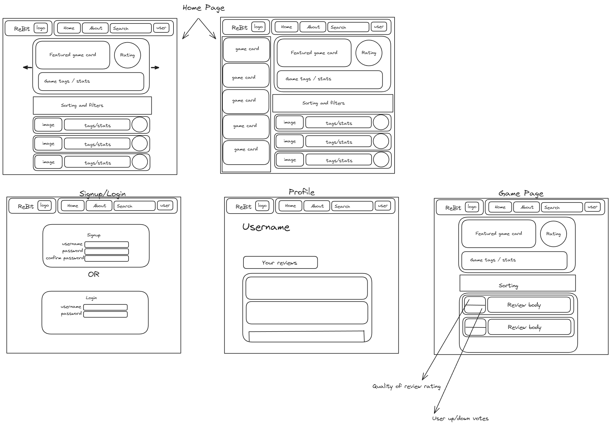

# Project Title - ReBit

## Overview

The app's purpose is to provide reviews for video games based on some form of quantatative measure. It will allow users to interact with reviews, altering their ranking and post new ones.

### Problem

Currently, the review systems that exist on many platforms is simple and does not take into account the content of the review, this makes it more difficult for users to get an informed opinion on what games are good, and which are not. The other problem that exists is that there is no way to sort by number of positive reviews relative to the number of total players. Generally speaking, the larger the percentage of a game's playerbase that leave a review, the better the game is (this is speculation, which this project will give information on)

### User Profile

The intended user is someone that plays a variety of games, always looking for a new one to try out. The age range for the intended user is irrelevant since people from all ages play video games and may be interested in reading reviews for them

### Features

Log-in

Sentiment Analysis on all reviews to rank them with objective language.

Reviews made on the web page will be stored on a database, along with preassigned categories that the user can assign a number out of 10.

filter for explicit language

## Implementation

### Tech Stack

Sentiment analysis (node library)

MySQL for database

### APIs

Steam API by steam, and Steam api by third party (to get around rate limits by steam)

### Sitemap

- Home page - List of games with overall ranking, and sorting by category, ranking, date of last update and date of publishing
- Game page - Overall information for game and reviews. These are split in two, reviews from steam database and reviews made on this app.
- Log-in page

### Mockups

### Data

- Username and password: User's Id will be linked to their reviews, their password and their username.
- Game - each game will have it's reviews linked to them, aswell as key game information such as active playerbase, date of latest update, date of publish, images related to the game, categories the game falls under, ranking in each category.

### Endpoints

- /
  - GET list of games and overview information
- /:id
  - GET details about a specific game using it's id.
- /:id/reviews
  - GET all reviews for a game
  - POST a new review about a game
  - PUT edit a review that a user has written in the past
  - DELETE a review that a user has written in the past

### Auth

#### Authentication:

- Single factor authentication - only password is required

#### Authorization:

- A user can only post a review if they are logged in.
- A user can only edit or delete their own reviews.
- A user does NOT have to be logged in to view any of the pages

## Roadmap

1. Sentiment analysis with mock data
2. Database setup
   - setup tables
   - setup migrations and seed
3. Backend setup
   - use knex with the appropriate endpoints to handle data in the correct format
4. Setup ReactApp
   - Routes
5. Home page
   - Header component
   - Featured Game card component
   - Filter/Sorting functionality
   - Results game card component
6. Game Page
   - review card component
7. Auth
   - backend auth
   - frontend auth
8. Login/Signup page
9. Profile page

## Nice-to-haves

- AI compiles all reviews and generates one with the average sentiment of all users.
- Multiple uses of sentiment analysis, one for ranking the reviews in terms of objective language, and one for ranking them in terms of relatability, and humour.
- Fancy "gamer-like" animations
- deployment
- Seperate out steam reviews from this app's reviews for seperate tracking.
- Search functionality
